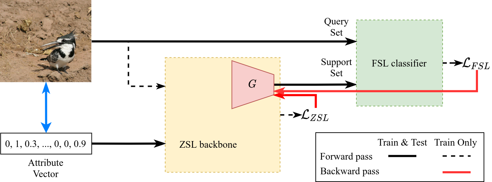

# End-to-end Generative Zero-shot Learning via Few-shot Learning

  

Alse, check [this repo](https://github.com/gchochla/z2fsl-tfvaegan) for the Z2FSL implementation of TF-VAEGAN.

### Abstract




> Contemporary state-of-the-art approaches to Zero-Shot Learning (ZSL) train generative nets to synthesize examples conditioned on the provided metadata. Thereafter, classifiers are trained on these synthetic data in a supervised manner. In this work, we introduce Z2FSL, an end-to-end generative ZSL framework that uses such an approach as a backbone and feeds its synthesized output to a Few-Shot Learning (FSL) algorithm. The two modules are trained jointly. Z2FSL solves the ZSL problem with a FSL algorithm, reducing, in effect, ZSL to FSL. A wide class of algorithms can be integrated within our framework. Our experimental results show consistent improvement over several baselines. The proposed method, evaluated across standard benchmarks, shows state-of-the-art or competitive performance in ZSL and Generalized ZSL tasks.

Also, link to paper ([preprint](https://arxiv.org/pdf/2102.04379.pdf)).

---

## Results

<table>
    <tr>
        <td></td>
        <td colspan=3><b>Zero-shot Learning</b></td>
        <td colspan=9><b>Generalized Zero-shot Learning</b></td>
    </tr>
    <tr>
        <td></td>
        <td> CUB </td>
        <td> AwA2 </td>
        <td> SUN </td>
        <td colspan=3>CUB</td>
        <td colspan=3>AwA2</td>
        <td colspan=3>SUN</td>
    </tr>
    <tr>
        <td></td>
        <td>aT1</td>
        <td>aT1</td>
        <td>aT1</td>
        <td>u</td>
        <td>s</td>
        <td>H</td>
        <td>u</td>
        <td>s</td>
        <td>H</td>
        <td>u</td>
        <td>s</td>
        <td>H</td>
    </tr>
    <tr>
        <td>Z2FSL</td>
        <td>62.5</td>
        <td>68.0</td>
        <td>66.5</td>
        <td>47.2</td>
        <td>61.2</td>
        <td>53.3</td>
        <td>57.4</td>
        <td>80.0</td>
        <td>66.8</td>
        <td>44.0</td>
        <td>32.9</td>
        <td>37.6</td>
    </tr>
</table>

---

## Run locally

First, you need to setup your environment. Activate your Python3 environment (`virtualenv`, `conda`, etc), switch to the root directory of the project and run:

```bash
pip install -e .[dev]
```

### **Pretrained** Few-shot learners

Pretrained Few-shot learners are integral for our framework. Here we describe how you can either download pretrained models or train them yourselves. In any cases, it is highly suggested to save them under the same directory, as the interface only asks for the containing directory and the specific learner is retrieved internally by name.

To download your desired pretrained Few-shot learners, click on the corresponding link:

<small>P.S.: Few-shot learners trained on `train` split are only necessary for a potential hyperparameter search.</small>

| Datasets | ZSL | GZSL |
| :---- | :----: | :----:|
| CUB | [train](https://drive.google.com/file/d/1DJN9f9R9jVeXRrJoyDgjJd4UwFJ_HMB7/view?usp=sharing), [trainval](https://drive.google.com/file/d/1bVy2aFW9szHJqMK0lVpd9asiC1KM5Z_H/view?usp=sharing) | [train](https://drive.google.com/file/d/1SaJe2abqJ0owUOUuZKJPOdLgFdsfgafN/view?usp=sharing), [trainval](https://drive.google.com/file/d/1-1jwAp-3UAxfjGtkrz9dfkiRDJNANy3y/view?usp=sharing) |
| AwA2 | [train](https://drive.google.com/file/d/1WD6sZDCzE-JNg3VglenbO9njH8HbGTzb/view?usp=sharing), [trainval](https://drive.google.com/file/d/1qiRQqitAEiJ8_aEBUcRnjoj1ngRnLJSN/view?usp=sharing) | [train](https://drive.google.com/file/d/1iN5W9y30FDnXDkjfwEd17LrutXwAmeTX/view?usp=sharing), [trainval](https://drive.google.com/file/d/1-63B1BEue3OECEmD3iPH2QzgXhj9ihFe/view?usp=sharing) |
| SUN | [train](https://drive.google.com/file/d/1-2iMmfbaPCyuqf2yNe5vqfaYtn5RNXx1/view?usp=sharing), [trainval](https://drive.google.com/file/d/1-6fHiIInP6qYkD7Qj-PgLJsplgKinRt7/view?usp=sharing) | [train](https://drive.google.com/file/d/156k-1BPxxzQ-JkLYI3_D-Lv08CPCioX5/view?usp=sharing), [trainval](https://drive.google.com/file/d/1-0d2vvNpJzX68nwgDoIea86hKhALnCRY/view?usp=sharing) |

*Alternatively*, train them yourself by executing the corresponding scripts in `./scripts`, e.g. for CUB in ZSL:

```bash
chmod +x scripts/run_fsl_cub.sh  # _gen.sh for GZSL
scripts/run_fsl_cub.sh -m /path/to/fsl-directory -d /path/to/cub-root -c cuda:17
```

### Reproduce

After you have succesfully downloaded the dataset of interest and gotten access to the corresponding  pretrained Few-shot learner, simply execute the corresponding script in `./scripts`, e.g. again for CUB in ZSL:

```bash
chmod +x scripts/run_cub.sh
scripts/run_cub.sh -m /path/to/fsl-directory -d /path/to/cub-root -c cuda:42
```

Results are expected to somewhat deviate from reported <small>(we couldn't get the seeds to work due to PyTorch's design)</small>

### Contributions

Feel free to fork or propose changes via opening issues and/or PRs.
